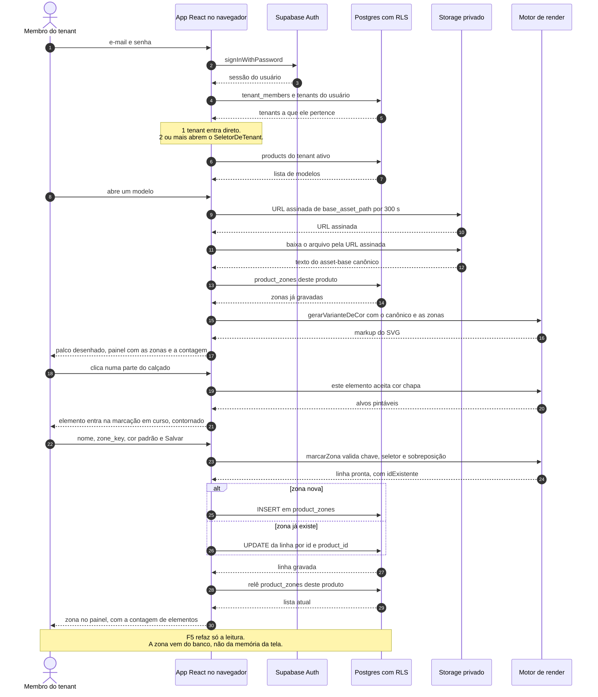

# Fluxo, marcar zona num modelo

> Do login à zona gravada: o caminho ponta-a-ponta em que um **membro** de um **tenant**
> abre um **modelo**, clica nas partes do calçado que formam uma **zona**, dá nome a ela e
> a vê continuar lá depois de recarregar a página. É a entrega da Fase 1.
>
> Escrito a partir do código vigente (`src/App.tsx`, `src/features/`, `src/lib/render/`,
> `supabase/migrations/`). Onde este documento e o código divergirem, **o código manda** e
> este arquivo está errado, corrija-o.

---

## 1. O que este fluxo entrega, e por que ele é o fluxo crítico

O resultado do fluxo é **uma linha em `product_zones`**: `zone_key`, `svg_selector`,
`label`, `cor_default`. Nada mais é escrito, nem o asset-base, nem o canônico, nem
arquivo nenhum no Storage.

Essa linha é o que a API de variante vai consumir para decidir qual pedaço do desenho
recebe qual cor. Marcar a zona errada aqui não produz erro nenhum agora: produz **cor no
lugar errado numa peça já fabricada**, semanas depois. É por isso que quase toda decisão
descrita abaixo é "recusar cedo, com o motivo escrito" em vez de "aceitar e avisar
depois", o princípio nº1 do `CLAUDE.md` aplicado passo a passo.

---

## 2. Atores e handoffs

| Ator | Papel neste fluxo | Onde ele aparece no código |
|---|---|---|
| **Membro do tenant** | Faz login, escolhe o tenant, abre o modelo, clica no calçado, nomeia a zona | - |
| **App (React, no navegador)** | Todo o fluxo. Não existe backend próprio: o app fala direto com o Supabase | `src/App.tsx` monta as telas por `useState`, sem roteador |
| **Supabase Auth** | Autentica e mantém a **sessão**; o token é renovado sozinho | `src/lib/supabase/cliente.ts` (`persistSession`, `autoRefreshToken`) |
| **Postgres + RLS** | Guarda `tenant_members`, `products` e `product_zones`. A RLS é quem recusa dado de outro tenant, o filtro no front é defesa em profundidade, nunca a barreira | `supabase/migrations/20260812_correcao_rls_e_storage.sql` |
| **Storage (bucket privado `assets-base`)** | Guarda o asset-base canônico. Sem URL pública: acesso só por URL assinada de curta validade | `src/features/produtos/baixarAssetBase.ts` |
| **Motor de render** | Decide o que é pintável, o que é cor válida, o que é `zone_key` válida, o que é sobreposição, e desenha o palco | `src/lib/render/` |
| **API de variante** | **Fronteira. Ainda não existe.** É a peça seguinte: vai ler `product_zones` e o canônico e devolver o SVG/PNG colorido |, (nenhum arquivo hoje) |

### Os handoffs, em uma frase cada

1. **Pessoa → App**: e-mail e senha; depois, cliques no palco e texto no formulário.
2. **App → Auth**: `signInWithPassword`; o sucesso volta pelo `onAuthStateChange`, um
   caminho só para montar a sessão.
3. **App → Postgres**: quais tenants o usuário tem, quais produtos o tenant tem, quais
   zonas o produto tem, e o INSERT/UPDATE da zona no fim.
4. **App → Storage**: URL assinada a partir de `products.base_asset_path`, e o download do
   texto do canônico.
5. **App → Motor de render**: o mesmo módulo que a API vai importar. O palco desenha a
   saída de `gerarVarianteDeCor`, nunca cor por CSS, é o que sustenta *cor no editor =
   cor na API*.
6. **App → API de variante**: **não acontece nesta entrega.** O handoff é assíncrono e
   indireto: a linha gravada em `product_zones` é o contrato que a API vai ler depois. Por
   isso `zone_key` é tratada como chave pública desde o formulário, quando a API existir,
   renomeá-la quebra a integração de um cliente.

---

## 3. Diagrama de sequência, caminho feliz

---

## 4. Caminho feliz, passo a passo

| # | Passo | Arquivo que executa | O que ele valida / garante |
|---|---|---|---|
| 1 | O app sobe e confere a configuração | `src/features/AreaProtegida.tsx` → `src/lib/supabase/configuracaoDoSupabase.ts` | Sem `.env.local` preenchido a tela diz o que falta, em vez de uma tela de login que recusa toda senha |
| 2 | Login | `src/features/sessao/TelaDeLogin.tsx` → `ContextoDeSessao.tsx` | O botão só habilita com e-mail e senha preenchidos; falha vira uma frase genérica, que não revela quem tem conta |
| 3 | Sessão montada | `src/features/sessao/ContextoDeSessao.tsx` | Sucesso chega pelo `onAuthStateChange`, caminho único, que também cobre logout em outra aba e expiração |
| 4 | Tenants do usuário | `src/features/sessao/carregarTenantsDoUsuario.ts` | Campos explícitos (`papel`, `tenants!inner(id, nome, slug, tema)`), filtro por `user_id` além da RLS, ordem alfabética estável |
| 5 | Escolha do tenant | `src/features/sessao/SeletorDeTenant.tsx`, `RotaProtegida.tsx`, `tenantLembrado.ts` | Um tenant entra direto; dois ou mais exigem escolha. O tenant lembrado no `localStorage` é **preferência**, não permissão: o contexto só aceita id que veio da lista do banco |
| 6 | Portão | `src/features/sessao/RotaProtegida.tsx` | Nada protegido renderiza sem usuário **e** tenant ativo; o `children` é função, então não há caminho com `tenantAtivo` nulo |
| 7 | Lista de modelos | `src/features/produtos/hooks/useProdutos.ts` → `listarProdutos.ts` | Campos explícitos, `.eq('tenant_id', …)` e `.order('created_at')`, sem `order` o Postgres não promete ordem e a lista embaralha entre cargas |
| 8 | Abrir o modelo | `src/features/produtos/TelaDeProdutos.tsx` | Trocar de tenant remonta a tela inteira (`key={tenant.id}` em `src/features/AreaProtegida.tsx`): o SVG de uma marca nunca sobrevive à troca para outra |
| 9 | Baixar o asset-base canônico | `src/features/produtos/hooks/useAssetBase.ts` → `baixarAssetBase.ts` | URL assinada de **300 s** a partir do `base_asset_path` **gravado**, nunca remontado; o retorno é **texto**, porque o editor precisa do SVG no DOM para poder clicar nele |
| 10 | Moldura e selo | `src/features/produtos/VisualizacaoDoProduto.tsx` + `TelaDeProdutos.tsx` | O selo "N elementos marcáveis" conta pela **mesma** regra do motor (`PINTAVEIS` + `expandirPintaveis`), não por `[id]`, número que não bate com o que dá para marcar é pior que número nenhum |
| 11 | Carregar as zonas gravadas | `src/features/zonas/hooks/useZonasDoProduto.ts` → `listarZonasDoProduto.ts` | Campos explícitos, `.order('created_at')`; erro **sobe** em vez de virar lista vazia, porque "nenhuma zona" sobre um produto mapeado faria o time remarcar tudo por cima |
| 12 | Desenhar o palco | `src/features/zonas/PalcoDeMarcacao.tsx` | O markup sai de `gerarVarianteDeCor`, sempre, inclusive sem cor pedida. Realce é **camada `<svg>` separada** com `<use>`, nunca filtro/sombra/overlay sobre o desenho |
| 13 | Painel de conferência | `src/features/zonas/EditorDeZonas.tsx` → `PainelDeZonas.tsx` | Contagem por zona vem de `relatorioDeZonas` e as sobreposições de `zonasSobrepostas`, os dois do motor, nunca de uma conta local |
| 14 | Clicar num elemento | `PalcoDeMarcacao.tsx` (`closest('[id]')`) → `resolverZonaDoElemento.ts` → `EditorDeZonas.tsx` (`aoClicarElemento`) | Elemento sem **id de elemento** não vira zona: o clique morre ali, porque id nasce na normalização e nunca no editor (ADR-005). Clicar de novo no mesmo elemento **desmarca** (`marcacaoEmCurso.ts`) |
| 15 | Nomear a zona | `src/features/zonas/FormularioDeNovaZona.tsx` | `validarZoneKey` e `validarCor` rodam **antes** do banco; sem elemento marcado o salvar fica desabilitado **com o motivo escrito**. A `zone_key` é sugerida a partir do rótulo, e confirmada pela pessoa, nunca trocada sozinha |
| 16 | Montar a linha | `src/features/zonas/marcarZona.ts` (puro) | Revalida a chave, confere que cada id existe no canônico, expande pintáveis, recusa sobreposição e monta `svg_selector` **só** por `montarSeletorDeZona`, lista de ids exatos, jamais prefixo. Por último confere que o seletor montado resolve **exatamente** a marcação, inclusive os ids que já estavam gravados (ADR-005) |
| 17 | Gravar | `useZonasDoProduto.gravar` → `src/features/zonas/gravarZonaNoBanco.ts` | `idExistente === null` → INSERT; caso contrário → UPDATE filtrado por `id` **e** `product_id`. `upsert` cego é proibido: apagaria o mapeamento de um colega. O UPDATE nunca mexe em `zone_key` nem em `product_id` |
| 18 | Reler | `useZonasDoProduto` (segunda chamada a `listarZonasDoProduto`) | A tela passa a mostrar o que o **banco** tem, não o que ela mandou gravar, é a mitigação registrada para o last-write-wins (§6.2) |
| 19 | Limpar o formulário | `EditorDeZonas.tsx` (`aoSalvar`) | Só depois de gravar de fato: marcação, rótulo, chave e cor voltam ao vazio |
| 20 | Recarregar a página | passos 1–13 de novo | A zona sobrevive porque ela **está no banco**. A tela não guarda nada: `product_zones` é a única fonte |

### O que faz a zona sobreviver ao F5, em uma frase

A sessão persiste no cliente Supabase (`persistSession`), o tenant escolhido persiste como
preferência no `localStorage`, e a zona persiste **no Postgres**. Nada do que importa mora
na memória da tela, e nada do que a tela mostra é escrito no asset-base.

---

## 5. Fluxos de erro

Eles importam tanto quanto o caminho feliz: neste produto, o erro que **não** aparece vira
cor errada em peça fabricada.

### 5.1 Recusas no CLIQUE (antes de qualquer coisa entrar na marcação)

Prevenção de erro > mensagem de erro: o elemento nem chega a entrar na marcação em curso.
As três moram em `EditorDeZonas.tsx`, na função `aoClicarElemento`.

| O que a pessoa fez | O que o sistema responde | Onde é decidido |
|---|---|---|
| Clicou num elemento **que já pertence a outra zona** | Recusa nomeando a zona dona: *"Esse elemento já pertence à zona X. Para acrescentar elementos a ela, use essa mesma chave."* Nada entra na marcação | `EditorDeZonas.tsx` (`aoClicarElemento`), com a zona resolvida por `resolverZonaDoElemento.ts`, pelo **mesmo caminho** que o motor usa para pintar |
| Clicou num **contorno `fill="none"`** (costura, linha de desenho) | Recusa explicando que pintá-lo mudaria o desenho, não a cor da zona | `alvosPintaveis` devolve lista vazia (`src/lib/render/alvosPintaveis.ts`); a recusa é montada em `EditorDeZonas.tsx` |
| Clicou num elemento com **gradiente ou padrão** (`fill="url(...)"`) | Recusa falando do **elemento**: *"Esse elemento é pintado com gradiente ou padrão. Virar cor chapa apagaria o volume do modelo…"* Código: **`ZONA_NAO_RECOLORIVEL`**. A frase do motor fala de *zona* e é a certa na geração, onde a zona existe e tem nome; no clique não há zona, e ela saía como `A zona "esta zona" usa gradiente…` (BUG-017) | A DECISÃO é do motor, `alvosPintaveis` lança; a FRASE é reescrita por `motivoDaRecusaDeClique` em `EditorDeZonas.tsx` |
| Clicou num ponto **sem elemento endereçável** (nenhum ancestral com `id`) | Nada acontece, em silêncio, e é intencional: cunhar um id na hora tornaria o canônico mutável (ADR-005) | `PalcoDeMarcacao.tsx`, `closest('[id]')` |
| Clicou **enquanto as zonas ainda carregam, falharam ou estão sendo gravadas** | O palco está desabilitado: o clique não faz nada. Marcar sem conhecer as zonas atuais criaria sobreposição sem ninguém ver | `EditorDeZonas.tsx` (`desabilitado={zonas.estado !== 'pronta' \|\| zonas.salvando}`) |

Detalhe que muda o comportamento na prática: a recusa por "já pertence a outra zona"
compara com a `zone_key` **digitada no formulário naquele momento**. Se a chave digitada
for a mesma da zona dona, o clique é aceito, é exatamente o caso "acrescentar mais um
elemento a esta zona", que vira UPDATE.

### 5.2 Recusas ao SALVAR

| O que a pessoa fez | O que o sistema responde | Onde é decidido |
|---|---|---|
| **`zone_key` inválida** (maiúscula, acento, espaço, começa com número, acima de 40 caracteres) | O erro aparece **sob o campo, enquanto ela digita**, e o botão salvar fica desabilitado. Código: **`ZONE_KEY_INVALIDA`** | `validarZoneKey` (`src/lib/render/validarZoneKey.ts`); a exibição é `FormularioDeNovaZona.tsx`, e `marcarZona.ts` revalida como segunda barreira para quem não passa pelo formulário |
| **Cor padrão que não é hex** | Erro sob o campo e salvar desabilitado. Campo vazio **não** é erro: `cor_default` é opcional | `validarCor` (`src/lib/render/validarCor.ts`), exibido por `FormularioDeNovaZona.tsx` |
| **Nenhum elemento marcado** | Salvar desabilitado, com a próxima ação escrita ("clique no desenho as partes que formam esta zona"), botão cinza sem explicação vira chamado de suporte | `FormularioDeNovaZona.tsx` (`semElemento`) |
| **Duas zonas dividindo elemento** (BUG-013) | Recusa antes do banco: *"A zona X dividiria N elemento(s) com a zona Y"*. Código: **`ZONAS_SOBREPOSTAS`** | `recusarSobreposicao` em `src/features/zonas/marcarZona.ts` |
| Um id marcado **não existe mais no canônico** | Recusa pedindo recarregar a página: o desenho mudou desde que o editor abriu. Código: `ZONA_NAO_ENCONTRADA` | `marcarZona.ts` |
| A zona existente tem **seletor legado de prefixo** (`[id^="…"]`) | Recusa pedindo remarcar a zona do zero, em vez de adivinhar o que aquele seletor captura hoje | `idsDoSeletor` em `marcarZona.ts` |
| O seletor **já gravado** aponta para elemento que não existe mais neste desenho | Recusa nomeando os ids mortos e pedindo remarcar a zona. Sem isso, acrescentar um elemento regravaria o seletor carregando o id morto junto, e a zona passaria a pintar menos do que o painel promete, em silêncio (BUG-018) | `conferirQueOSeletorResolveAMarcacao` em `marcarZona.ts`; é a conferência que o ADR-005 já prometia |

Por que `ZONAS_SOBREPOSTAS` ainda acontece se o clique já barra elemento de outra zona:
porque a chave pode mudar **depois** dos cliques. Marcar elementos da zona `a` com a chave
`a` digitada é legítimo (UPDATE); trocar a chave para `b` antes de salvar transforma a
mesma marcação em sobreposição, e quem barra isso é `marcarZona`.

### 5.3 Erros de banco, rede e RLS

| Situação | O que o sistema responde | Onde é decidido |
|---|---|---|
| **`zone_key` já gravada por outra pessoa** enquanto esta tela estava aberta (INSERT bate na `unique (product_id, zone_key)`, Postgres **`23505`**) | *"A zona X já foi marcada, recarregue a página para ver a marcação atual antes de editar."* A lista já carregada **não** é apagada da tela | `traduzir` em `src/features/zonas/gravarZonaNoBanco.ts`; a `unique` está em `supabase/migrations/20260812_schema_inicial.sql` |
| **A linha sumiu** entre abrir e salvar (UPDATE não acha nada; `PGRST116` ou zero linhas) | *"A zona X não existe mais neste produto, recarregue a página para ver a versão atual."* Fingir sucesso deixaria a marcação só na tela de quem gravou | `atualizarZona` / `zonaSumiu` em `gravarZonaNoBanco.ts` |
| **Falha de rede ou RLS ao carregar as zonas** | Estado `erro` na lateral do editor, com botão **"Tentar de novo"**, e o palco desabilitado. A lista nunca vira `[]` silencioso | `useZonasDoProduto.ts` + `EditorDeZonas.tsx`; `listarZonasDoProduto.ts` deixa o erro subir |
| **Falha de rede ao baixar o asset-base** | *"…a rede não respondeu. Confira a conexão e tente de novo."* com botão **"Tentar de novo"**, que rebaixa sem sair do modelo. A área do editor fica oculta (`.produto__area[hidden]`, BUG-015). Rede e servidor são distinguidos pela **estrutura** da falha (só a recusa do servidor traz `status`), nunca por comparar o texto em inglês do navegador (BUG-016) | `baixarAssetBase.ts` + `useAssetBase.ts` (`recarregar`) + `VisualizacaoDoProduto.tsx` |
| **Recusa do servidor / RLS ao baixar o asset-base** (403, 404) | Frase em português com o status e o texto do servidor entre parênteses, mais o mesmo botão de nova tentativa | `baixarAssetBase.ts` |
| **Produto sem `base_asset_path`** | *"Este produto não tem asset-base gravado."*, falha antes da rede | `baixarAssetBase.ts` |
| **Gravar sem tenant ativo** | Recusa antes da rede: *"Escolha uma marca antes de gravar a zona."* Sem `tenant_id` a linha seria órfã e a RLS a esconderia de todo mundo, inclusive de quem a criou | `useZonasDoProduto.ts`, com a mesma guarda repetida em `gravarZonaNoBanco.ts` |
| **Gravou, mas a releitura falhou** | A tela **não** pede para gravar de novo (a zona já está no banco): o erro aparece como falha **da lista**, com "Tentar de novo" | `useZonasDoProduto.ts` |
| **O motor recusa desenhar o palco** (sobreposição gravada, gradiente numa zona com cor de teste, seletor quebrado) | O palco mostra o canônico **cru** e um alerta com a mensagem **e o código** do erro. Nunca "quase certo" | `desenharPeloMotor` em `PalcoDeMarcacao.tsx` |
| **Sessão perdida / logout em outra aba** | A tela protegida sai do ar e volta ao login pelo `onAuthStateChange`, sem tela desenhada sobre uma sessão morta | `ContextoDeSessao.tsx` |

### 5.4 A URL assinada de 300 s expirando

Vale descrever com precisão, porque a intuição erra aqui:

- A URL é **criada e consumida na mesma função**: `createSignedUrl` e, na linha seguinte,
  o `fetch` (`baixarAssetBase.ts`). Os 300 s são a folga entre assinar e baixar, não uma
  janela de trabalho.
- Depois do download, o canônico vive **como texto na memória da tela**. Um editor aberto
  por horas continua desenhando e marcando: nada é rebaixado do Storage enquanto o
  `base_asset_path` não mudar (é a única dependência do efeito em `useAssetBase.ts`).
- Expirar de fato só machuca no intervalo entre assinar e baixar, rede muito lenta,
  máquina suspensa no meio do carregamento. O sintoma é o alerta de download com o status
  HTTP, e a recuperação é voltar à lista e abrir o modelo de novo.
- O que **não** expira em silêncio é a sessão: o cliente Supabase renova o token sozinho
  (`autoRefreshToken`), e quando a sessão realmente morre a tela volta ao login em vez de
  gravar contra um token vencido.

---

## 6. Pontos críticos

### 6.1 Onde dá para perder dado sem ninguém ver (BUG-014)

Acrescentar um elemento a uma zona existente reabre o formulário **vazio**. Se o campo
vazio fosse traduzido como "apague", o UPDATE limparia o `label` que um colega escreveu, e
o sintoma seria nenhum: a zona continua gerando a cor certa, só perde o nome.

A regra vigente está em `preservarOuLimpar` (`EditorDeZonas.tsx`) e no contrato de
`marcarZona`:

| Valor enviado | Significado | Efeito |
|---|---|---|
| `undefined` (campo vazio **em zona que já existe**) | "não mexi nisso" | Preserva o que está gravado |
| `null` (campo vazio **em zona nova**) | "não tem" | Grava `null` |
| Texto | "passa a valer isto" | Grava o texto |

Quem mexer em `EditorDeZonas.tsx` ou em `marcarZona.ts` precisa manter os três casos
distintos: colapsar `undefined` e `null` num só reintroduz o BUG-014.

### 6.2 Last-write-wins conhecido no UPDATE (aceito, não resolvido)

`product_zones` não tem `updated_at` (ver a DDL em
`supabase/migrations/20260812_schema_inicial.sql`), então **não há lock otimista**: dois
membros editando a **mesma** zona ao mesmo tempo terminam com o último UPDATE valendo, sem
aviso para o primeiro.

- **Mitigação vigente**: reler `product_zones` logo depois de gravar
  (`useZonasDoProduto.ts`). Quem gravou vê imediatamente o estado real do banco, incluindo
  o que o colega mudou no meio do caminho.
- **O que a mitigação não cobre**: a janela entre carregar a tela e salvar. Um colega pode
  criar uma zona que captura um elemento que já está na minha marcação em curso; como as
  duas checagens (`resolverZonaDoElemento` no clique e `recusarSobreposicao` no salvar)
  leem a lista **em memória**, o INSERT passa e a **sobreposição de zonas** nasce no banco.
  Quem denuncia isso é o painel, na carga seguinte: `zonasSobrepostas` mostra o alerta
  antes da lista de zonas, e `gerarVarianteDeCor` recusa o pedido inteiro se as duas zonas
  pedirem cor (BUG-013). Ou seja: o estado inválido é **detectado e visível**, não
  impossível.
- Lock otimista está fora do escopo desta fase (§7), exigiria migration.

### 6.3 Por que o asset-base canônico é imutável (ADR-005)

O editor é **somente-leitura** sobre o canônico: marcar zona escreve uma linha em
`product_zones` e nada mais. Nenhum arquivo de `src/features/zonas/` importa
`normalizarSvg`.

O motivo é concorrência, não elegância: **o Storage não tem escrita condicional** (sem
If-Match/ETag no `supabase-js`). Se o editor cunhasse `id` ao marcar e regravasse o SVG,
dois membros marcando ao mesmo tempo se sobrescreveriam: o id de um sumiria do arquivo
enquanto o `svg_selector` dele continuaria no banco, resolvendo 0 elementos ou, pior, o
elemento errado, calado. Por isso o **id de elemento** nasce na normalização, uma vez, no
provisionamento.

### 6.4 O seletor de zona é lista de ids exatos, nunca prefixo

`svg_selector` é `#a, #b`, montado **só** por `montarSeletorDeZona` e desmontado só por
`idsDoSeletor`. Prefixo (`[id^="zona-cadarco"]`) capturaria uma zona futura
`zona-cadarco-lateral` e pintaria o lugar errado sem avisar, o modo de falha exato que o
princípio nº1 existe para impedir.

### 6.5 Um motor só

Preview do editor e geração da API são o **mesmo** `gerarVarianteDeCor`; a contagem do
painel é `relatorioDeZonas`; "o que é pintável" é `alvosPintaveis`; "o que é cor" é
`validarCor`. O palco **nunca** pinta por CSS. Duas implementações da mesma regra
divergiriam, e a divergência apareceria como cor errada em peça pronta.

Consequência de UX que decorre disso: **cor em edição ≠ cor válida**
(`coresDoPreview.ts`). `#C0` é rascunho, não erro, anunciar cada tecla ensina o time a
ignorar o alerta justo onde ele custa caro.

### 6.6 Isolamento entre tenants em cada salto

Marcas concorrentes coexistem no mesmo sistema, então o isolamento é requisito comercial
(ver `../11_SEGURANCA/multi-tenancy-rls.md`). Neste fluxo ele aparece em quatro lugares:

1. **RLS** em `products` e `product_zones` (select/insert/update por membro; delete só
   owner), é a barreira real.
2. **Filtro explícito** por `tenant_id` na lista de produtos e por `product_id` na lista de
   zonas: defesa em profundidade e intenção legível, nunca a barreira.
3. **Bucket privado + URL assinada curta**: não existe URL pública do asset-base de um
   lançamento.
4. **Remontagem da tela ao trocar de tenant** (`key={tenant.id}`): o estado da marca
   anterior não sobrevive à troca.

---

## 7. O que este fluxo ainda NÃO cobre

Decisões conscientes da Fase 1, registradas para não serem confundidas com esquecimento.
Nada abaixo existe hoje:

- **Upload de asset-base pelo navegador.** A normalização roda no provisionamento; não há
  tela de upload, recusa nem re-upload. Re-upload é o caso que quebra o modelo de asset
  imutável (exige remapear zonas) e merece decisão própria.
- **Apagar zona.** A RLS dá DELETE só ao owner e não há UI de papel, então também não há
  botão. Botão ambíguo no painel destruiria mapeamento.
- **Lock otimista em `product_zones`.** Sem `updated_at`, o UPDATE concorrente da mesma
  zona é last-write-wins (§6.2).
- **Coluna de ordem de zona.** A lista ordena por `created_at`; "ordem de leitura do
  calçado" não sobrevive sem coluna nova.
- **Marcar um `<g>` inteiro num clique.** Em SVG o alvo do evento é sempre a folha; N
  cliques para N elementos é aceitável agora.
- **A API de variante.** A função serverless que lê `product_zones` e devolve a variante é
  a peça seguinte, não existe nenhum arquivo dela hoje. Todo este fluxo termina na linha
  gravada.

---

## 8. Ligações

- `../08_DECISOES/adr-005-editor-de-zonas-em-svg-dom.md`, editor em SVG DOM, quem cunha o
  id, asset-base imutável, seletor de ids exatos
- `../08_DECISOES/adr-004-contrato-de-zona-e-normalizacao-de-svg.md`, contrato de zona,
  normalização e a recusa de gradiente
- `../03_REGRAS_DE_NEGOCIO/glossario.md`, nomenclatura obrigatória (zona, palco,
  asset-base canônico, sobreposição de zonas, sessão…)
- `../11_SEGURANCA/multi-tenancy-rls.md` e `../11_SEGURANCA/README.md`, modelo de ameaças
  e o checklist de isolamento que este fluxo precisa respeitar
- `../../src/features/zonas/README.md`, índice da feature que executa os passos 11–19
- `../../src/features/produtos/README.md`, lista de modelos e download do asset-base
- `../../src/lib/render/README.md`, o motor importado pelo editor e, depois, pela API
- `../07_APIS/autenticacao.md`, como o sistema do cliente autentica na API que consome o
  mapeamento gravado por este fluxo (chave de API por tenant, ADR-006). O resto do contrato
  da API entra em `../07_APIS/` quando a função existir
- `../../supabase/migrations/20260812_schema_inicial.sql`, DDL de `product_zones`,
  incluindo `unique (product_id, zone_key)`

---

## Atualizações

- **2026-09-07**, versão inicial, escrita a partir do código das Etapas 0–5.
